# Electrical Game Unreal — progress screenshots

This repository contains September 2026 progress images for the Unreal Engine 5.8 project. They show **work in progress**, not a finished realistic game. Most images are direct 1280 × 720 game-runtime screenshots; individually labeled model inspection renders are exceptions. The chisel comparison below crops only the window border from matched game-window captures; no game pixels were changed. Some exterior views use separate QA map copies for the camera and lighting.

## 24 September: physical cement sack and finite trowel load

Local isolated Unreal source commit `4358470` adds an editable 25 kg cement sack, a separate tear seal and opened mouth, and a visible 504 g dry-cement load on the worker's trowel. This image is a **Blender model inspection render**, not a game screenshot. The paper shape and printed finish still need art refinement.

In Unreal Play, the first left-click on an aimed sack opens it; the next takes one 504 g scoop. A left-click on the 20 L bucket deposits the carried dose if it fits. Seven actual `-game` Blueprint checks passed: tear, scoop, tool-switch retention, duplicate scoop rejection, deposit, full-bucket setup, and full-bucket retention. The Windows cook passed with zero errors and warnings. This is still in the isolated preview while the user's main Unreal Editor is open.

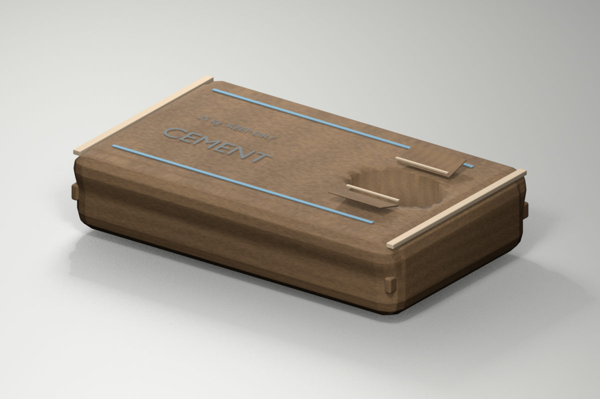

## 24 September: worker mortar trowel model

Local Unreal source commit `4ee46f7` adds a Blueprint-only held trowel. In Play, `9` equips it; left-clicking the 20 L bucket loads 70 g from the temporary finite wet mortar stock, and left-clicking a mortar joint applies that load. A separate Unreal `-game` Blueprint QA run passed both the 70 g transfer and edited-joint checks, followed by a Windows cook with 0 errors and 0 warnings. The mixing shortcut and plain materials remain prototypes. This feature is in the isolated preview branch and has not yet been integrated into the user's open main Editor session.

The image below is a **Blender model inspection render** of the editable trowel mesh and smaller 70 g wet-mortar mound. It is not an Unreal gameplay screenshot or proof of final material quality.

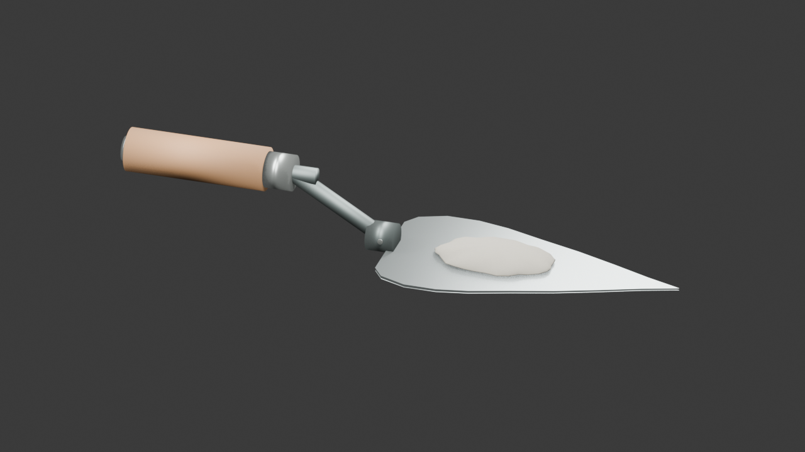

## 24 September: continuous starter wall and hammer proof

The user's saved house was copied into an isolated Unreal preview. Its central 12-course, inward-set work patch was replaced by 16 courses of the same two-wythe hollow-brick and mortar batches used in the neighboring wall. The inner and outer faces now align, with a 4 cm wall cavity. The first pair are direct 1280 × 720 `-game` captures at the same player start and camera. The bright work light and basic surface finish still need art work.

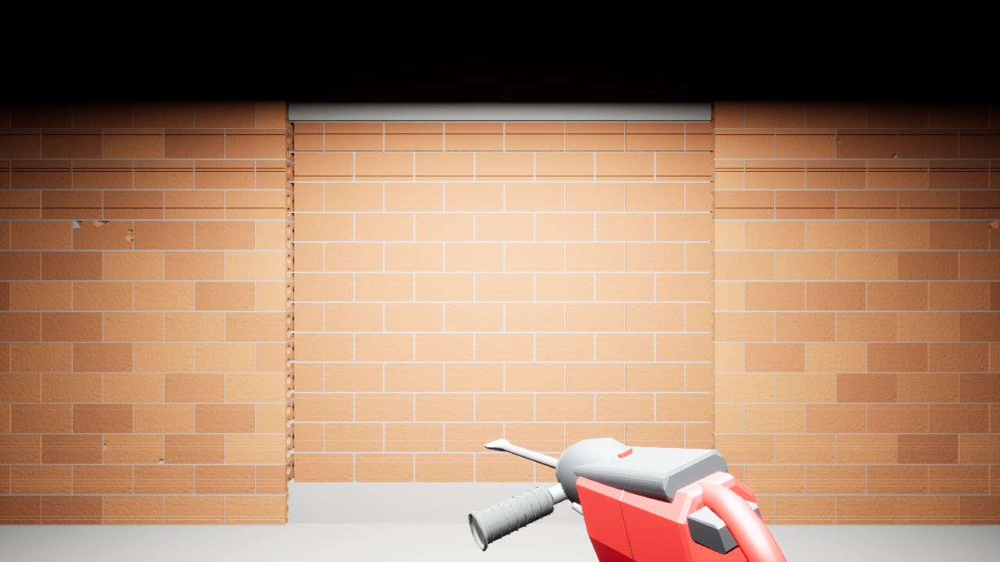

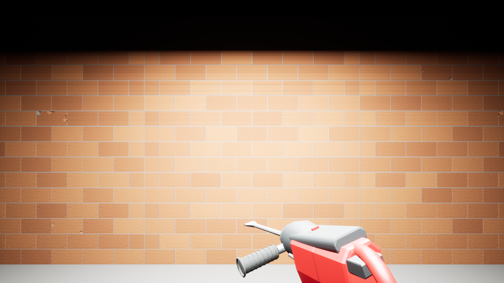

The second pair are real game-window captures at the same camera position, immediately before and after five left-click hammer strikes. The hollow clay brick shows a physical hole. The preview Windows cook completed 712 packages with 0 errors and 0 warnings. This repair is **in the isolated preview**, not yet in the user's open main Unreal Editor session.

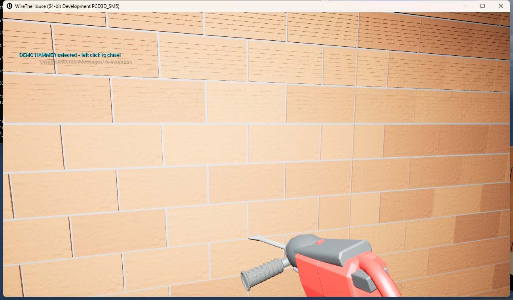

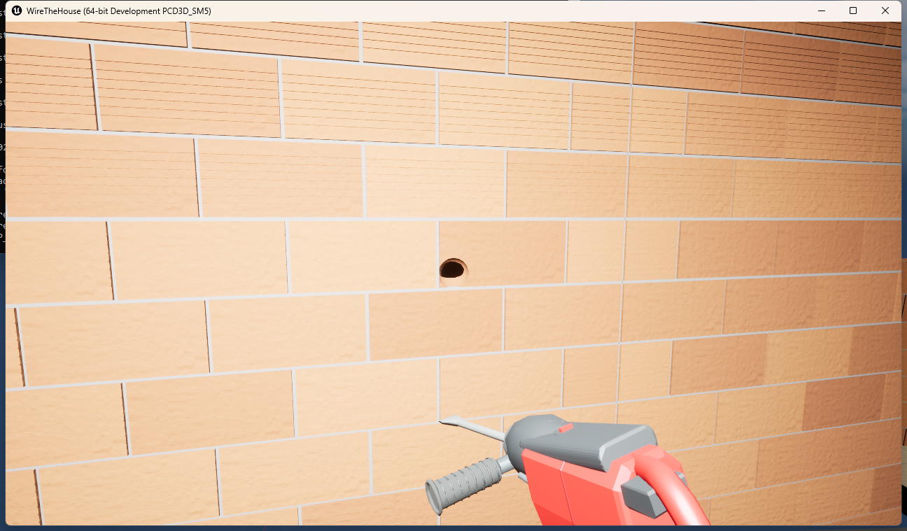

## 24 September: worker spirit level

Local Unreal source commit `7b568a4` adds the 600 mm aluminium spirit level as an editable Blender model imported to native Unreal meshes. In Play, `8` selects it; it seats against an aimed wall or floor and moves the appropriate physical air bubble. These direct `-game` screenshots come from plain QA scenes, not finished building art. The vertical-wall and 10° leaning-wall tests passed, and the lower plumb bubble visibly shifts to the right in the leaning-wall image. The flat-floor horizontal-vial test passed separately. The feature is verified in the isolated Unreal branch and has not yet been integrated into the user's open main Editor session.

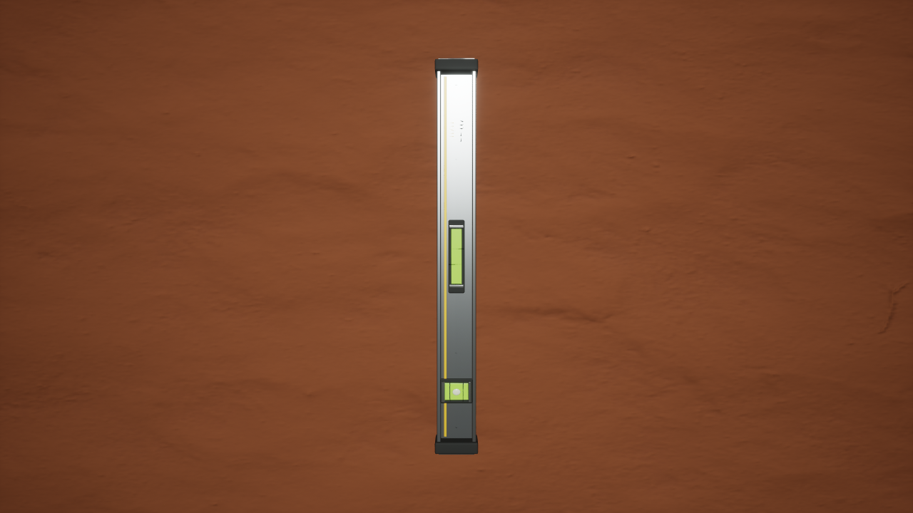

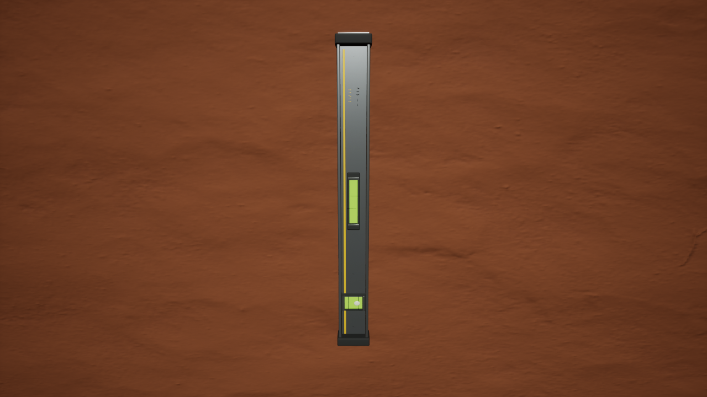

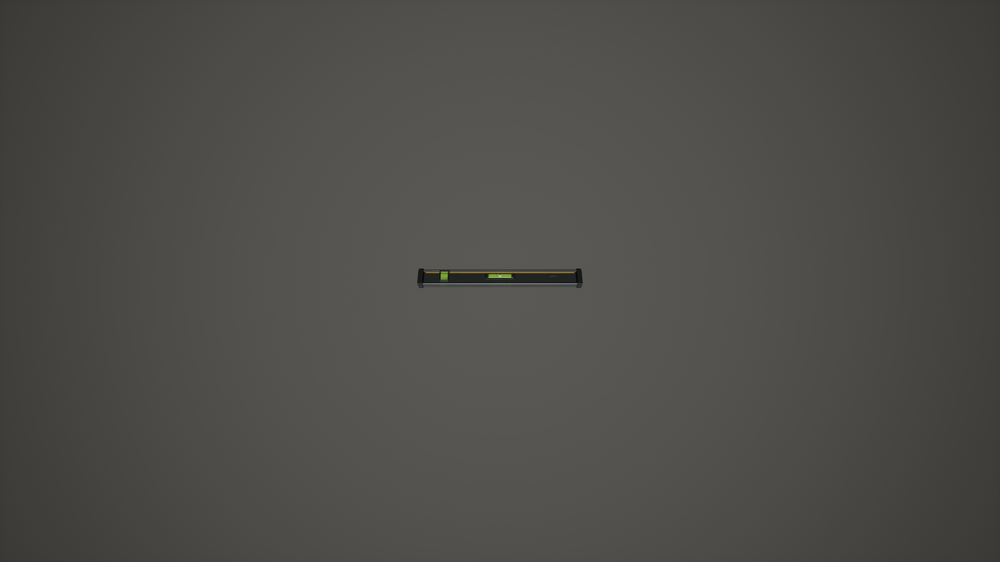

The first three screenshots below were captured from branch `codex/electrical-physical-mortar`, commit `6a90ac8`. The original Electrical Game web project remains separate. This repository contains screenshots only, not the Unreal project or a downloadable game.

## 24 September: worker tape measure and height mark

Local Unreal source commit `89bf133` adds a 5 m tape measure made from editable Blender source and native Unreal meshes. In Play, the worker equips it with `5`, measures a vertical wall from the floor, and marks a valid height with `M`. This direct `-game` capture is from a separate QA map, using the same Blueprint functions called by those controls. The automated run reported a valid 1.62 m reading and a spawned graphite mark. The plain test wall and lighting are for verification, not the final building art.

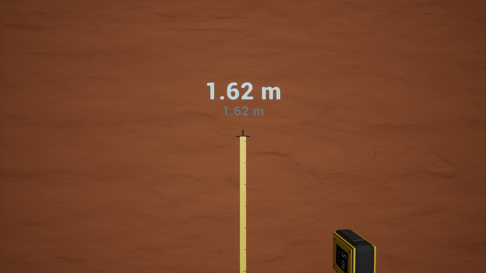

## 23 September: recessed electrical box screw positions

Local Unreal project commit `6bb41c2` adds editable 1G and 2G box models and native Static Meshes. The 1G has four open screw bores (top, bottom, left, right); the 2G has two (left and right). The first image is a front render of the actual editable Blender meshes, with the **2G on the left** and **1G on the right**. It is a model inspection render, not an Unreal screenshot.

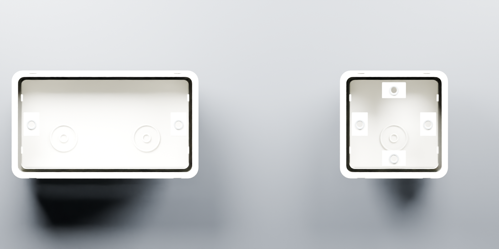

The next image is an unaltered Unreal `-game` capture from an isolated worktree. It shows the 1G and 2G meshes added to a live held assembly in the first-person construction scene. The lighting and box materials are still provisional; wall fit and final installation are not verified by this image.

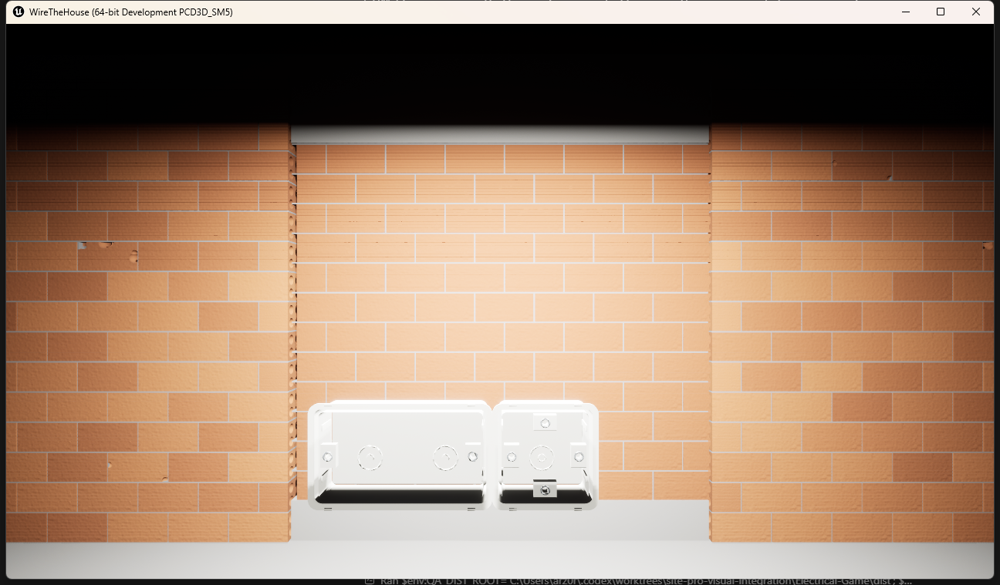

## 23 September: faster two-course brick wall

Local Unreal source commit `54e2d51` batches the 90 intact rear bricks while preserving their individual chisel cuts: the selected instance becomes a cuttable Blueprint brick when struck. The 90 rear mortar joints remain separate editable actors. The two matched 1280 × 720 game captures below use the same camera and show the wall before and after this rendering change. In a 300-frame static-camera comparison, draw calls fell from 1,511 to 1,244 on average; average frame time was effectively unchanged near the 240 FPS limit.

The next unaltered game-window capture shows a small hole after three real chisel clicks. The still image cannot prove which brick layer received the third hit; an Unreal actor/ray test separately verified that the rear instance was replaced and cut.

## 23 September: chisel across a two-course brick wall

Local Unreal source commit `84e1c58` replaces the central work wall's solid backing with a second course of hollow bricks and mortar joints. The two images use the same playable map, camera, viewport, and first-person state. Two real left-mouse chisel clicks open a visible hole in the front brick. A separate Geometry Script trace test reached the rear brick after cutting both front-brick faces. The other room walls are still visual brick skins over solid structure.

## 23 September: scanned plaster material

The Unreal project now uses a [Poly Haven Plastered Wall 02](https://polyhaven.com/a/plastered_wall_02) CC0 scan for nine construction-site plaster surfaces, with diffuse, normal, and roughness maps. These two unaltered runtime screenshots are from local Unreal project commit `508078a`. The exterior uses a copy of the playable map with only its camera moved; the wall screenshot comes from the playable map. This is a material improvement on a still-primitive building, not finished architecture.

## 23 September: masonry courses and mortar head joints

Local Unreal project commit `03e6bf3` adds 12 half bricks at alternating course boundaries and 78 independent vertical mortar joints. The new joints use Blueprint Geometry Script for chisel subtraction and mortar fill; an editor-world damage test verified mesh changes for both actions. The screenshot below is from the playable map in the Unreal game runtime at the same camera as `wall-main-pbr.png`. It shows the closed gaps, but the clay and mortar materials are still visually simple.

## Mortar station

The visible 5 L water jug and 20 L bucket are separate Blueprint actors. Their finite water transfer and targeted player controls exist, but the pouring animation, refill, complete mortar sequence, sounds, and final materials are unfinished.

## Building exterior

The current interior/exterior construction test building has an open doorway and the destructible brick wall visible inside. Much of the architecture and its materials remain blockout quality.

## Native water

The exterior basin uses Unreal's Water plugin. Its current colour and shoreline are still provisional.

These still images verify rendered scene content only. They do not prove final visual quality, performance, character animation, weather, audio, or end-to-end interaction.

## 23 September: structural room-wall QA sample

Local Unreal source branch `codex/electrical-room-brick-structure`, commit `ada6afa`, contains a separate QA map copy of the front-left room wall. Its old solid mortar core and thin brick faces were replaced in that copy by two layers of real hollow clay bricks with a 4 cm cavity and individual, chisel-editable head and bed mortar joints. These are direct 1280 × 720 game-runtime captures from the same camera; the rest of the playable room walls have **not** yet been converted.

A scripted test cut a through-opening after ten chisel blows. The mortar batch test confirmed the hit joint was promoted to editable geometry. In a 300-frame comparison of the QA wall, mean draw calls were 1,127 with each mortar joint as a separate actor and 100 with intact joints batched. The batched wall's GPU time remained above the original solid-core wall, so further performance and visual work is needed before promoting all nine room spans.

Local source commit `6a534e3` keeps already-cut brick meshes intact when this QA level reloads. Commit `5f0614d` makes the brick Blueprint set that preservation flag automatically after point damage. The next full-frame game-runtime capture shows the through-hole after ten real point-damage steps, with no manual flag setting in the QA script. The small image below is an unaltered pixel crop of that same capture, supplied so the hole is clear on a phone.

Saving arbitrary player-made damage through the in-game level editor is still unfinished.

## 23 September: first structural room span in the playable map

Local Unreal source branch `codex/electrical-room-brick-structure`, commit `10bad1d`, promotes the validated front-left wall into `/Game/Maps/ConstructionSite`. The old solid core and decorative 4 cm brick faces are gone from this span. Two layers of 320 hollow bricks surround a 4 cm cavity, with 288 vertical and 30 horizontal mortar joints. The other eight room spans still have their old solid cores and thin brick faces.

These six images are direct, unaltered 1280 × 720 Unreal `-game` captures. Each close before/after pair uses the same camera and viewport. The wide after views show the wall in the room and on the exterior elevation; the neighboring right-hand exterior span still shows the old construction.

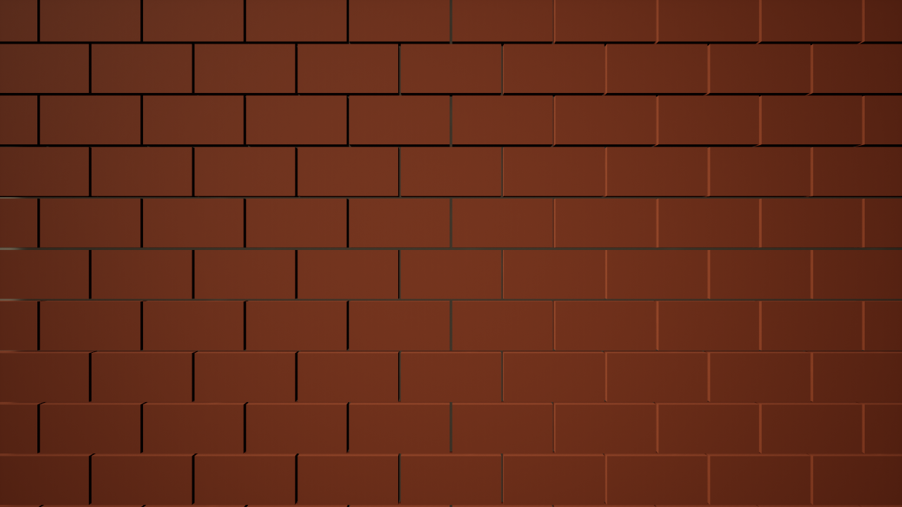

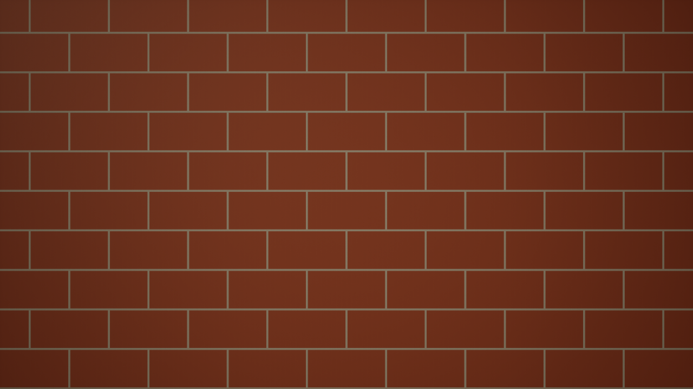

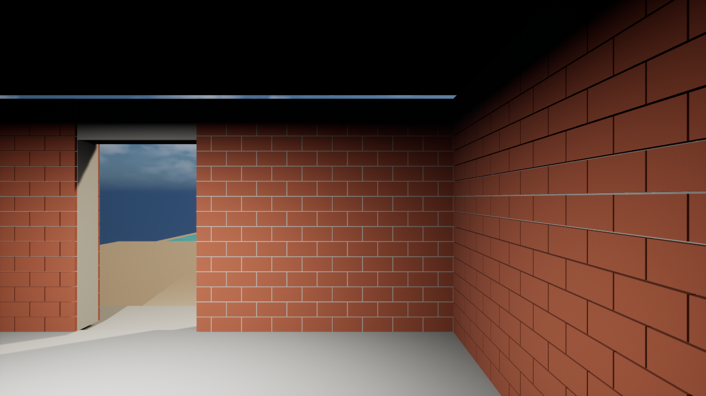

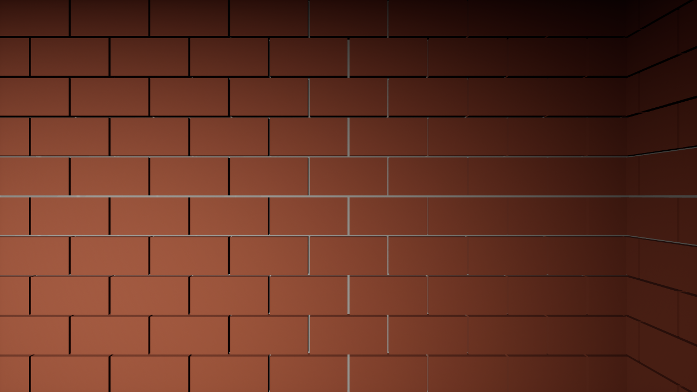

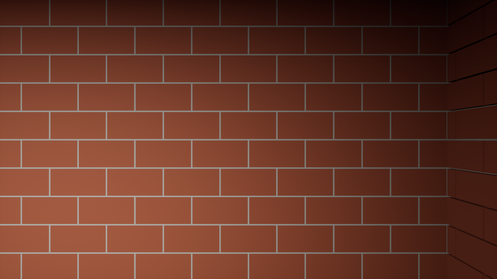

A fresh Editor test cut through both brick wythes with ten point-damage strokes and promoted one head and one bed joint to editable Dynamic Mesh actors. The Windows cook finished 616 packages with no errors or warnings. In a 300-frame static exterior camera comparison, p95 frame time rose from 6.443 to 7.442 ms and mean draw calls from 1,187 to 1,202. The captures do not show finished materials, weather, audio, the remaining structural walls, or in-game SaveGame persistence of cuts.

## 23 September: all nine structural room spans in the playable map

Local Unreal source commit `2c66479` replaces the other eight solid cores and decorative skins. The playable site now has 2,944 two-wythe hollow bricks, 2,692 vertical and 234 horizontal mortar joints, with a 4 cm cavity between the wythes. Six additional cut-brick sizes have their own shell, ribs, collision, and chisel-editable Blueprint. The two images below are direct 1280 × 720 game-runtime captures from QA copies of this playable map with only the camera position changed. The prior wide images above use the same camera positions, so the newly finished right elevation and right return can be compared directly.

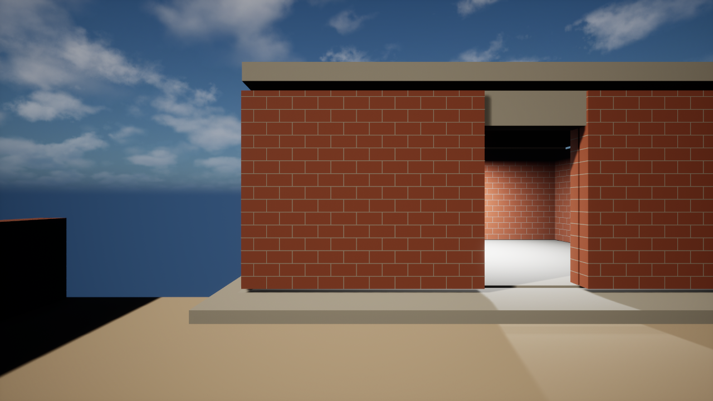

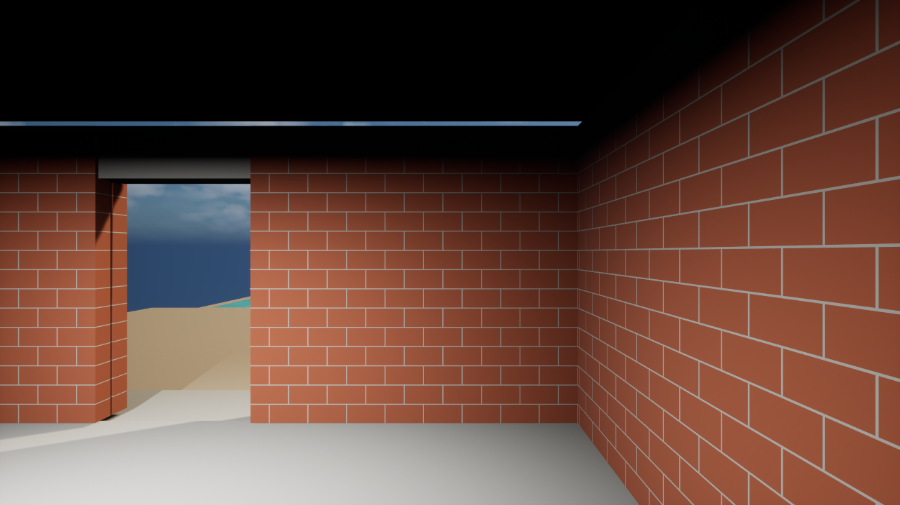

A fresh-process test opened a clear ray through both wythes in every span with ten point-damage strokes per location. A separate test cut rotated mortar on the left return. The Windows cook finished 633 packages with no errors or warnings. In a matched 300-frame Editor runtime comparison against the one-structural-span version, interior p95 frame time changed from 7.109 to 7.778 ms and mean draw calls from 114 to 189. Physical cavity ties, user-made cut persistence through F6/F7, richer materials, and the broader game systems remain unfinished.

## 23 September: real open clay cells and ridged faces

The local Unreal project now gives all ten brick sizes six open lengthwise cells and real raised lines on both long faces, following the supplied hollow-brick photo. The prior mesh enclosed its internal voids at both ends, making the wall look flat. These are direct, unaltered 1280 × 720 `-game` screenshots of the playable map; the corner view uses a separate map copy only to place the camera beside the exposed brick ends. The clay adds normal and roughness detail from [Poly Haven's CC0 Clay Plaster scan](https://polyhaven.com/a/clay_plaster), tinted to fired-clay red-orange. The geometry still needs more natural edge variation, and the scene lighting and mortar finish need work.

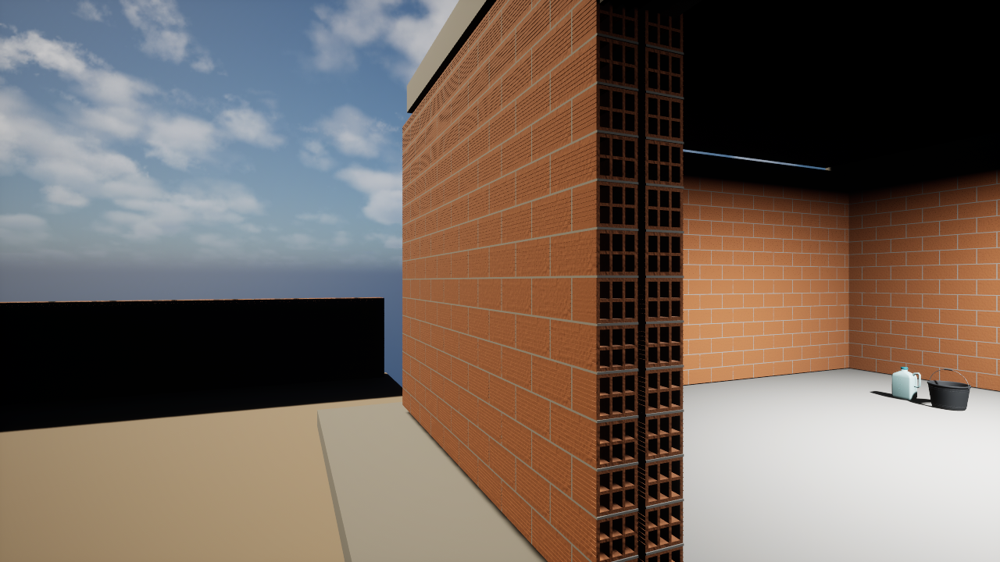

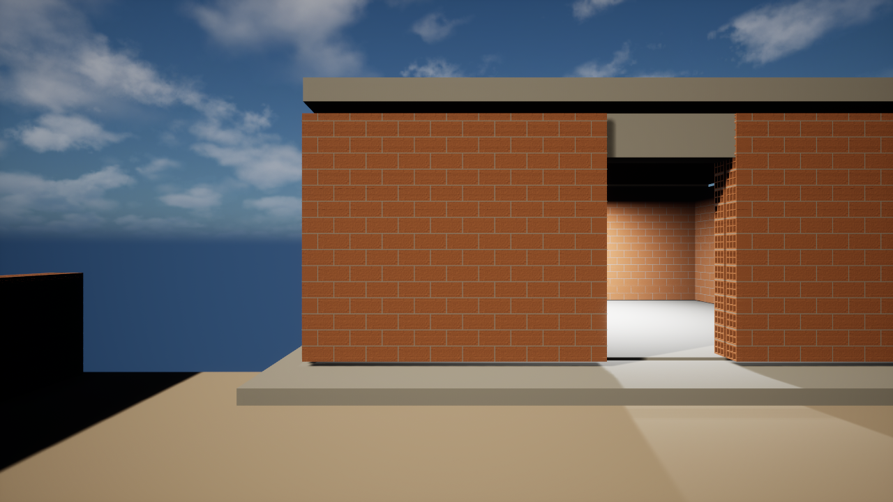

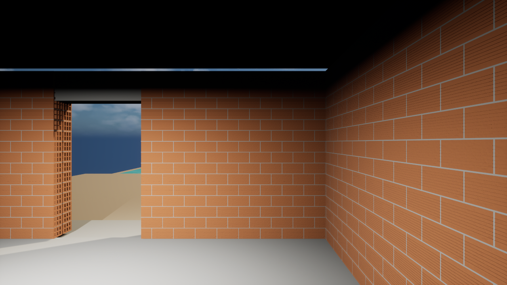

All nine two-wythe wall spans still passed the ten-strike through-wall test, and the half/short brick promotion and mortar fill checks passed. In a matched 300-frame exterior Editor-runtime comparison, mean GPU time changed from 2.812 to 2.948 ms and mean frame time from 4.985 to 5.197 ms; neither run had a frame above 16.67 ms. This is a static-camera Editor test, not packaged or active-chisel performance proof. In-game F6/F7 persistence is under development.

## 23 September: adjustable walls, rooms, floors, and first-person hammer

Local Unreal source commit `ac69fb7` adds draggable Blueprint markers for a hollow-brick wall with editable Rows and Columns and a room with editable width, depth, wall rows, and floor count. The default room has a 4 × 4 m **outer** footprint. This QA example uses two 2.8 m-high levels, three 20 cm concrete slabs, and 1,904 full-brick instances across eight wall spans. Each span uses batched intact bricks that can promote a hit brick into an editable hollow-brick actor. A test verified that resizing a wall or room after brick demolition is blocked to preserve the cut work. These are unaltered 1280 × 720 Unreal `-game` captures from the isolated QA map. The sand-coloured QA ground was added only for this progress view.

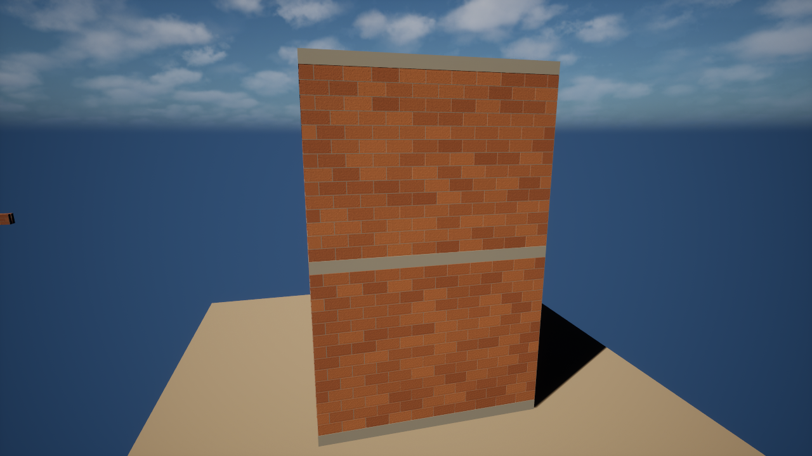

For the cutaway, the camera-facing two walls and roof slab are hidden **only in the QA map** so the two room levels and intermediate slab can be inspected. The generated room asset itself retains all four walls per floor and the roof.

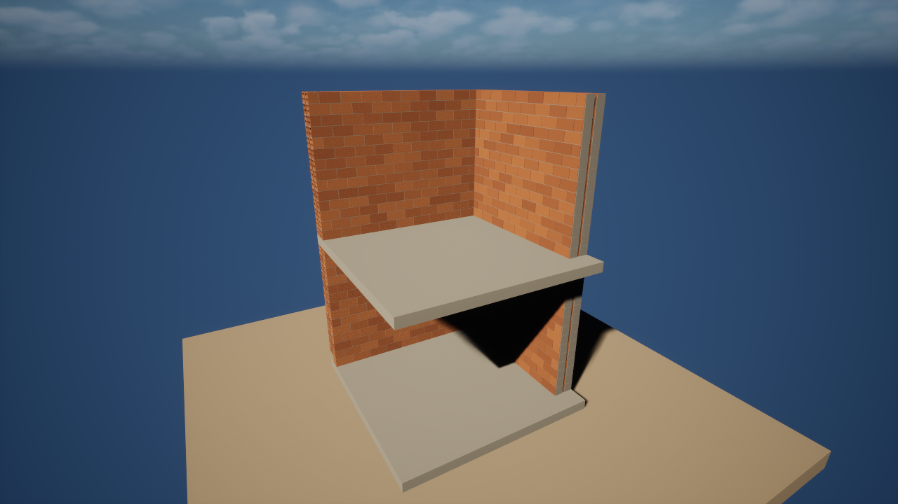

The following playable first-person capture shows the imported Electrical Game demolition hammer with its exposed chisel. Left-click still uses the Blueprint point-damage ray to hit individual bricks. The tool model and static pose need an animation, material and sound pass; the screenshot is not a claim of a finished worker tool.

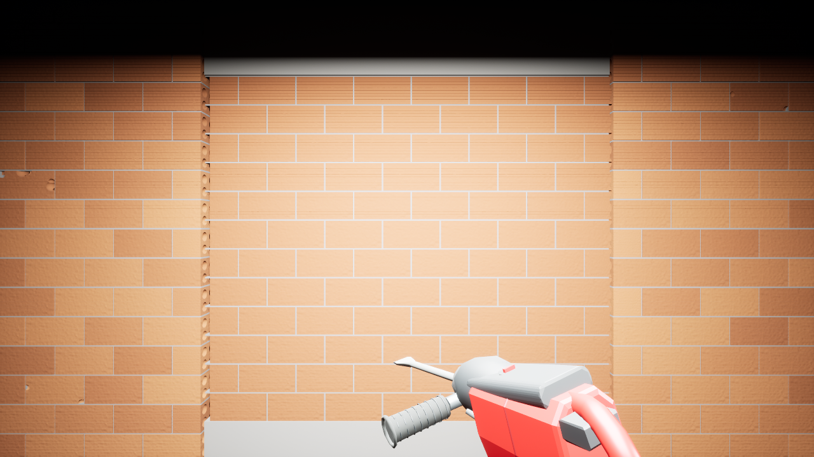

The new Editor commands are under **Tools > Wire the House**. The user's saved `ConstructionSite.umap` was kept out of the source commit. A Windows cook of the actual user project finished 658 packages without errors. Doorways, stairs, electrical boxes, playable in-game room generation, finished surfaces, audio, and wider performance tests remain to be built.

## 24 September: finite sand shovel in Play

Local isolated Unreal source commit `3a473cb` adds an editable square-mouth shovel, a separate visible 2.24 kg sand load, and a 600 kg stockpile Blueprint. The stockpile is an asset placed in the full Unreal Level Editor while Play is stopped; pressing `0` equips the shovel during Play. Left-click takes sand only from the pile under the crosshair and deposits it only into the bucket under the crosshair. A runtime test passed six mass checks, including no second scoop while loaded, load retained after tool switching, and load retained when the 20 L bucket rejects an overflow. Windows cook completed 732 packages with 0 errors and 0 warnings. This commit is in the isolated preview checkout; it has not yet been copied into the user's open Unreal Editor project.

The first image is a Blender render of the actual editable shovel model. The second is an unaltered 1280 × 720 Unreal `-game` screenshot with the shovel equipped in a copied brick-site level. It shows the current prototype pose and materials, not a finished character, animation or final lighting. The stockpile is tested in a separate QA scene and is not shown here.

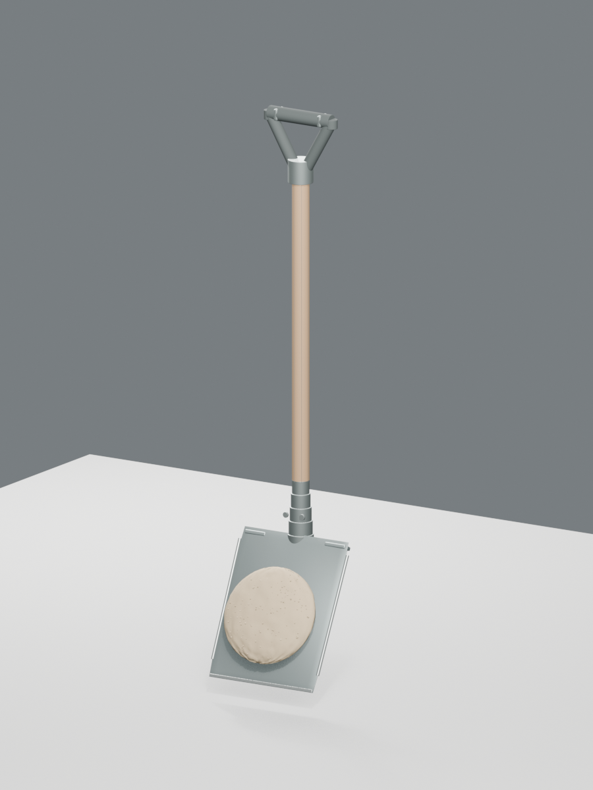

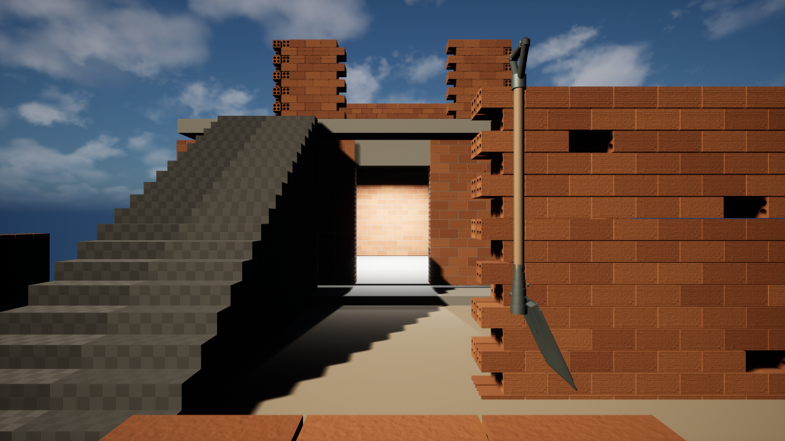
