# Electrical Game Unreal — progress screenshots

These are real 1280 × 720 Unreal Engine 5.8 game-runtime captures from 23 September 2026. They show the **current work in progress**, not a finished realistic game. Most images are direct in-engine screenshots. The chisel comparison below crops only the window border from matched game-window captures; no game pixels were changed. Some exterior views use separate QA map copies for the camera and lighting.

The first three screenshots below were captured from branch `codex/electrical-physical-mortar`, commit `6a90ac8`. The original Electrical Game web project remains separate. This repository contains screenshots only, not the Unreal project or a downloadable game.

## 23 September: faster two-course brick wall

Local Unreal source commit `54e2d51` batches the 90 intact rear bricks while preserving their individual chisel cuts: the selected instance becomes a cuttable Blueprint brick when struck. The 90 rear mortar joints remain separate editable actors. The two matched 1280 × 720 game captures below use the same camera and show the wall before and after this rendering change. In a 300-frame static-camera comparison, draw calls fell from 1,511 to 1,244 on average; average frame time was effectively unchanged near the 240 FPS limit.

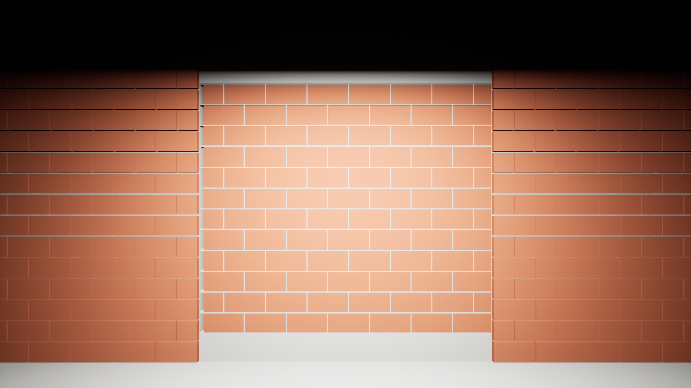

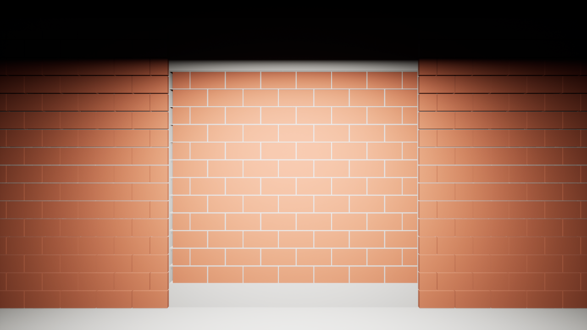

The next unaltered game-window capture shows a small hole after three real chisel clicks. The still image cannot prove which brick layer received the third hit; an Unreal actor/ray test separately verified that the rear instance was replaced and cut.

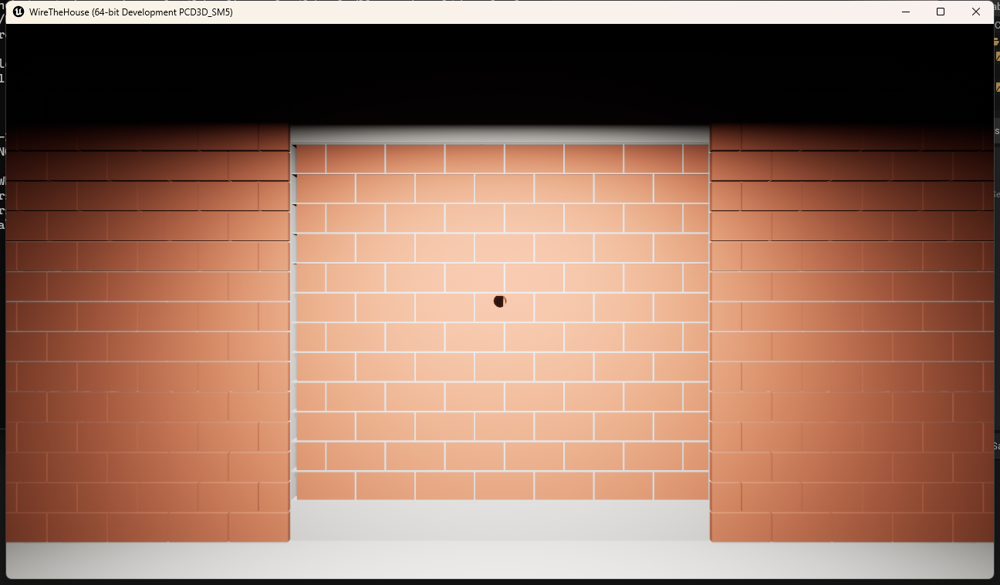

## 23 September: chisel across a two-course brick wall

Local Unreal source commit `84e1c58` replaces the central work wall's solid backing with a second course of hollow bricks and mortar joints. The two images use the same playable map, camera, viewport, and first-person state. Two real left-mouse chisel clicks open a visible hole in the front brick. A separate Geometry Script trace test reached the rear brick after cutting both front-brick faces. The other room walls are still visual brick skins over solid structure.

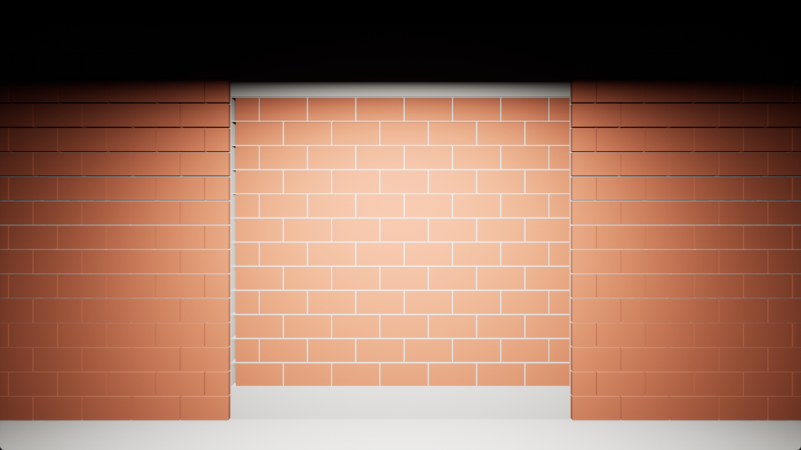

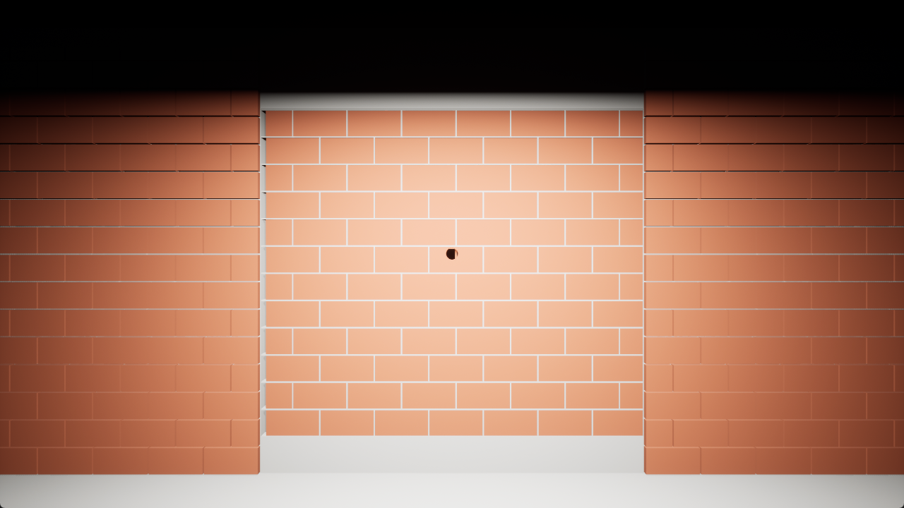

## 23 September: scanned plaster material

The Unreal project now uses a [Poly Haven Plastered Wall 02](https://polyhaven.com/a/plastered_wall_02) CC0 scan for nine construction-site plaster surfaces, with diffuse, normal, and roughness maps. These two unaltered runtime screenshots are from local Unreal project commit `508078a`. The exterior uses a copy of the playable map with only its camera moved; the wall screenshot comes from the playable map. This is a material improvement on a still-primitive building, not finished architecture.

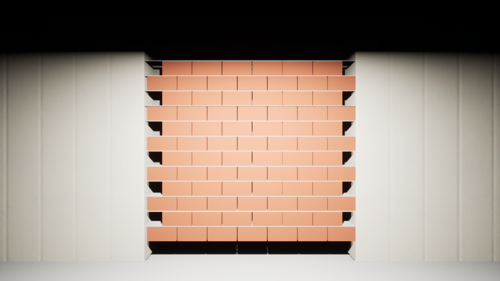

## 23 September: masonry courses and mortar head joints

Local Unreal project commit `03e6bf3` adds 12 half bricks at alternating course boundaries and 78 independent vertical mortar joints. The new joints use Blueprint Geometry Script for chisel subtraction and mortar fill; an editor-world damage test verified mesh changes for both actions. The screenshot below is from the playable map in the Unreal game runtime at the same camera as `wall-main-pbr.png`. It shows the closed gaps, but the clay and mortar materials are still visually simple.

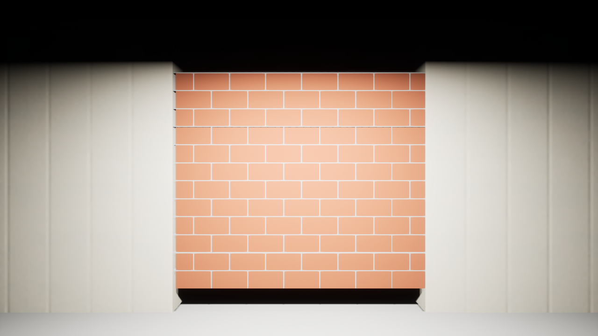

## Mortar station

The visible 5 L water jug and 20 L bucket are separate Blueprint actors. Their finite water transfer and targeted player controls exist, but the pouring animation, refill, complete mortar sequence, sounds, and final materials are unfinished.

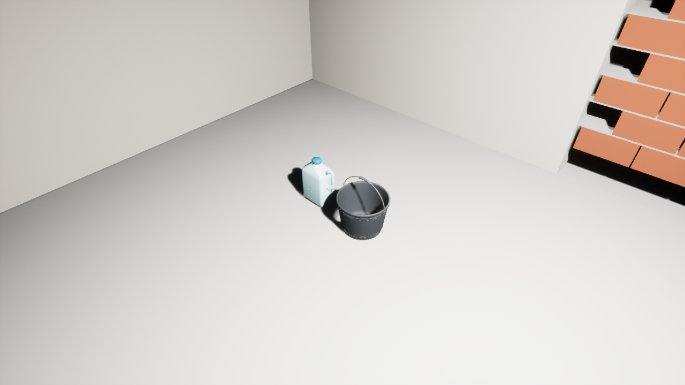

## Building exterior

The current interior/exterior construction test building has an open doorway and the destructible brick wall visible inside. Much of the architecture and its materials remain blockout quality.

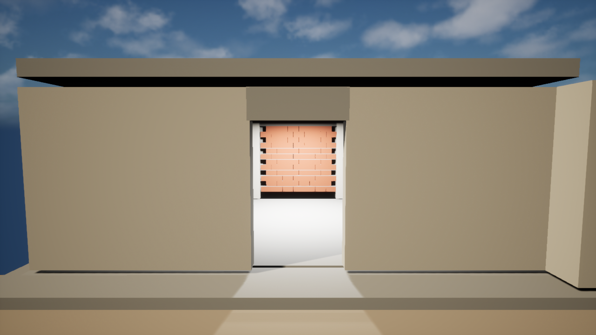

## Native water

The exterior basin uses Unreal's Water plugin. Its current colour and shoreline are still provisional.

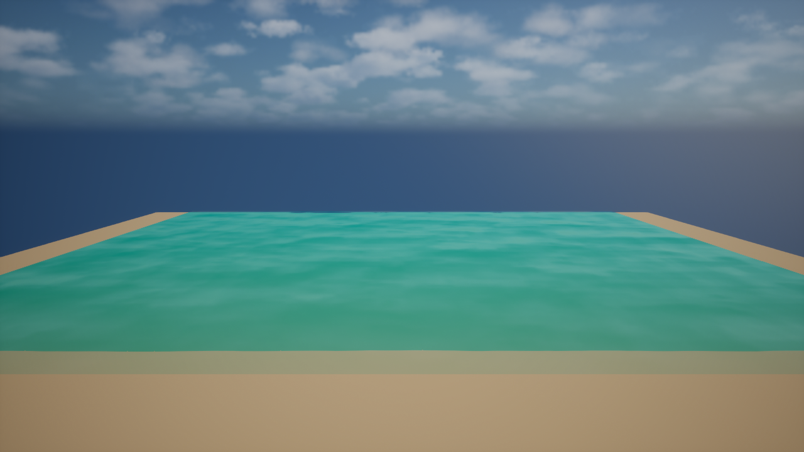

These still images verify rendered scene content only. They do not prove final visual quality, performance, character animation, weather, audio, or end-to-end interaction.

## 23 September: structural room-wall QA sample

Local Unreal source branch `codex/electrical-room-brick-structure`, commit `ada6afa`, contains a separate QA map copy of the front-left room wall. Its old solid mortar core and thin brick faces were replaced in that copy by two layers of real hollow clay bricks with a 4 cm cavity and individual, chisel-editable head and bed mortar joints. These are direct 1280 × 720 game-runtime captures from the same camera; the rest of the playable room walls have **not** yet been converted.

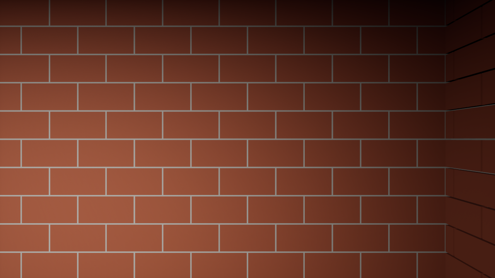

A scripted test cut a through-opening after ten chisel blows. The mortar batch test confirmed the hit joint was promoted to editable geometry. In a 300-frame comparison of the QA wall, mean draw calls were 1,127 with each mortar joint as a separate actor and 100 with intact joints batched. The batched wall's GPU time remained above the original solid-core wall, so further performance and visual work is needed before promoting all nine room spans.

Local source commit `6a534e3` keeps already-cut brick meshes intact when this QA level reloads. The next full-frame game-runtime capture shows the through-hole after ten real point-damage steps. The small image below is an unaltered pixel crop of that same capture, supplied so the hole is clear on a phone.

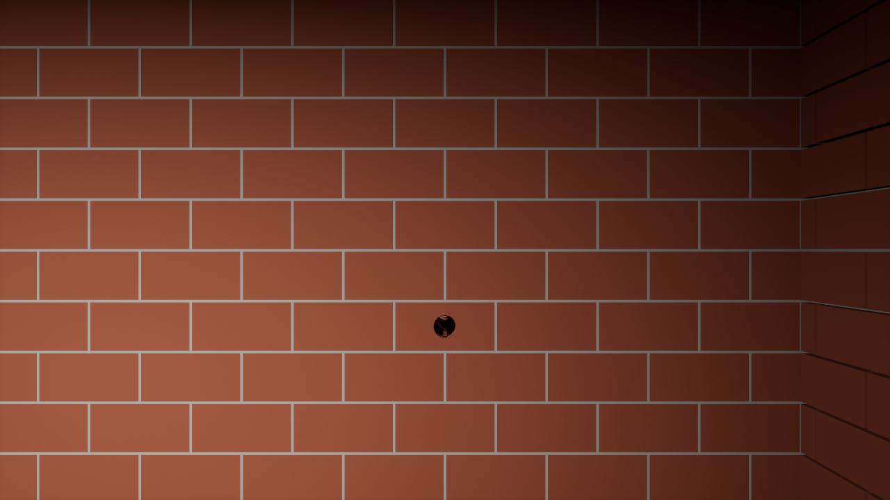

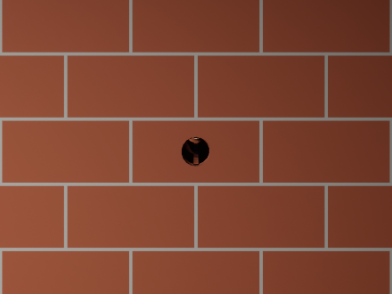

The saved-cut flag is applied in this QA map. Saving arbitrary player-made damage through the in-game level editor is still unfinished.
