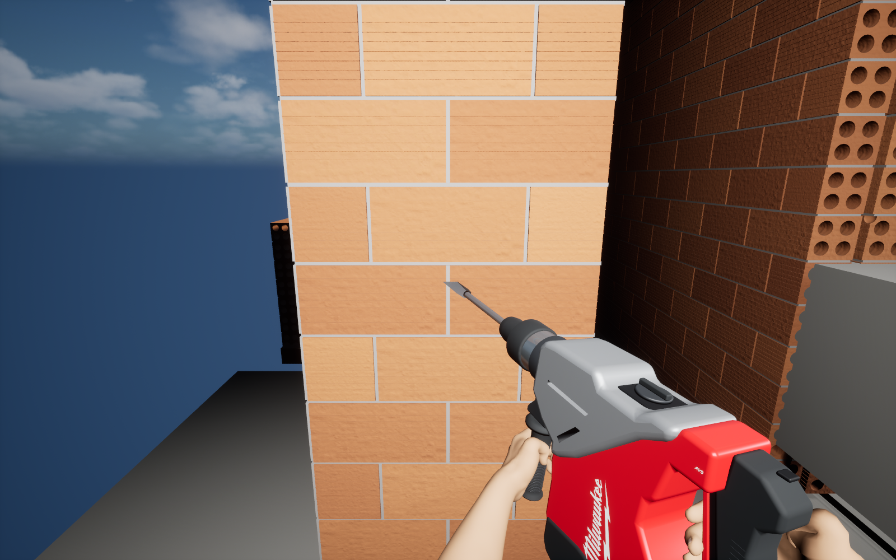
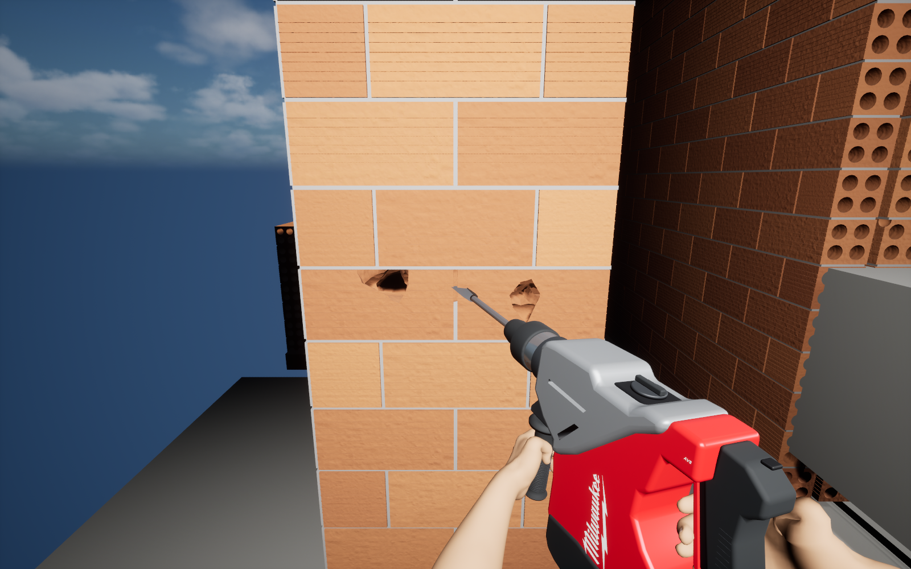
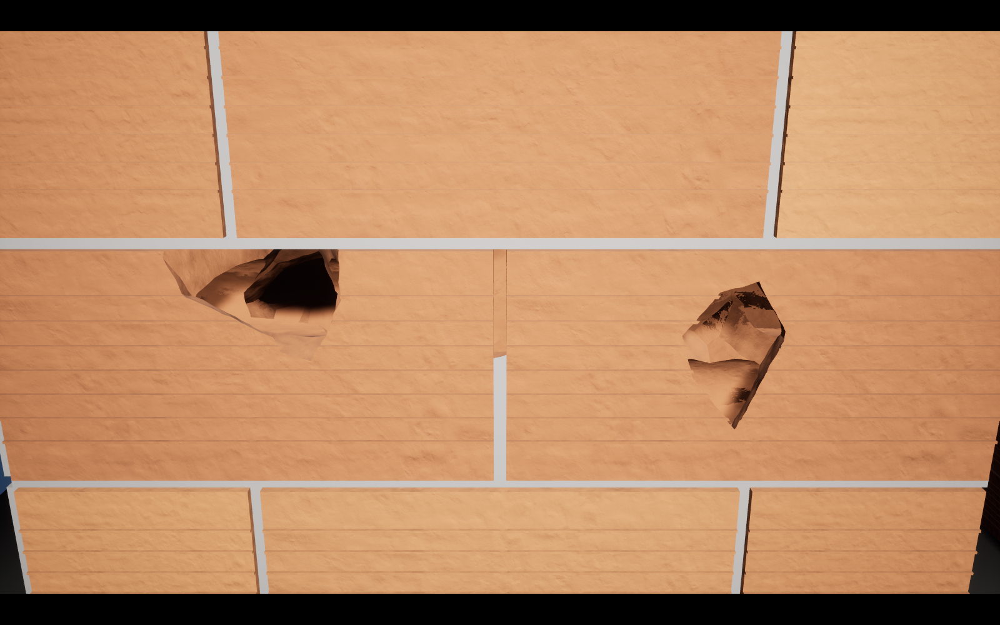
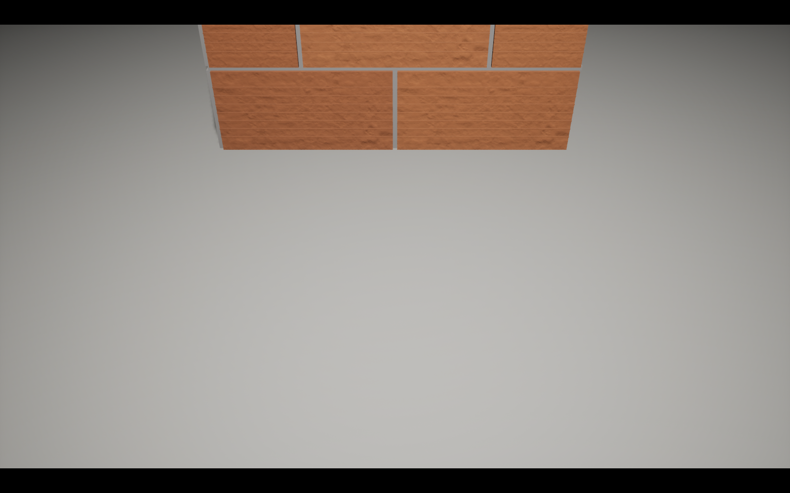

# Two-brick Chaos fracture slice — not accepted yet

Direct Unreal Engine 5.8.2 runtime screenshots, 1600 × 1000. Local source checkpoint `b0d03a1`. Existing FHACO745 hand pose is retained; wall/room construction stays in the Level Editor. No promotion into the main game.

The held hammer now produces irregular openings in two actual four-bore clay bricks and their mortar joint. This is a bounded pre-fractured Chaos experiment, not parity with the original continuous 8 mm material field.

**Debris physics fails acceptance:** six measured detached chips remain inside/behind the wall, and the ground inspection shows no settled rubble. A post-break velocity experiment was unstable and was reverted. More force is not an accepted fix; collider/separation diagnosis is required before expansion.

## Before — fixed FPS camera

## After — same camera, lighting and resolution

## Native closeup

A separate inspection camera, with the player hidden. The wall is the same runtime result. No image edits, AI retouching or substitute geometry.

## Failed debris criterion

Verified: 30 primary point-damage applications; zero additional hits after release, outside physical reach, or after switching tools. Eight bore-axis rays remain clear while the solid web and floor collide. The editor rebuild guard rejects overwriting the edited sample. Windows cook: 782 packages, 0 errors, 0 warnings; not a packaged executable test.

Short standalone DX12/SM5 desktop benchmark, 1600 × 1000, RTX 5080 / Core Ultra 9 285K, VSync off, other Unreal processes closed, no captures during timing: idle 3.15 ms mean / 7.27 ms max; held strikes plus release 3.52 ms mean / 7.79 ms p99 / 24.65 ms max; 0 frames over 33.33 ms. Not a whole-house or mobile claim. The earlier 37.63 ms result used a different wall width and is not a matched speedup comparison.

[Original-file hashes](manifest.json). The stable yard and previous wrist gallery remain available; this is a progress checkpoint with an explicit failed criterion, not a finished destruction release.
