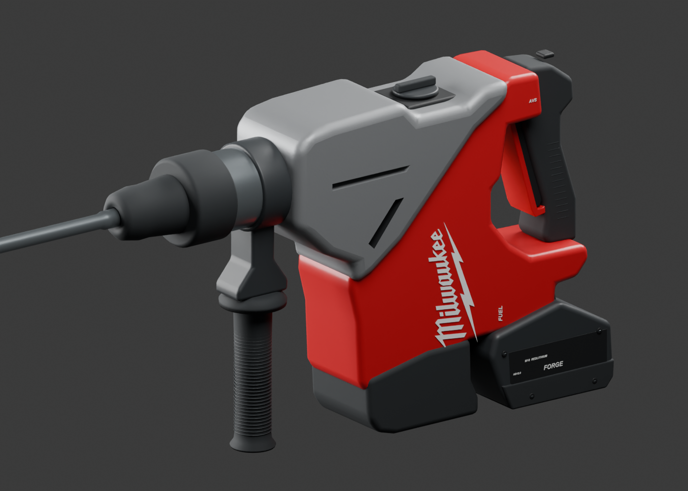
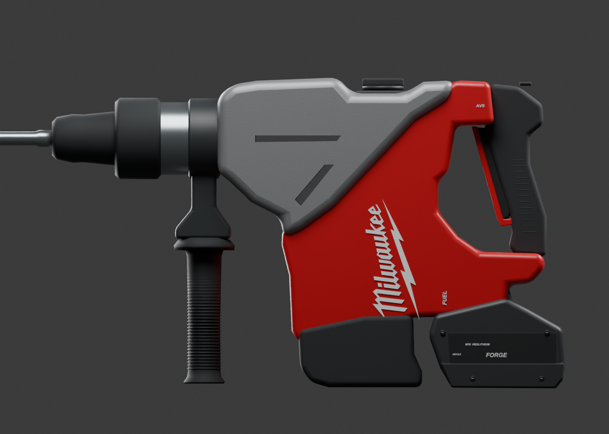
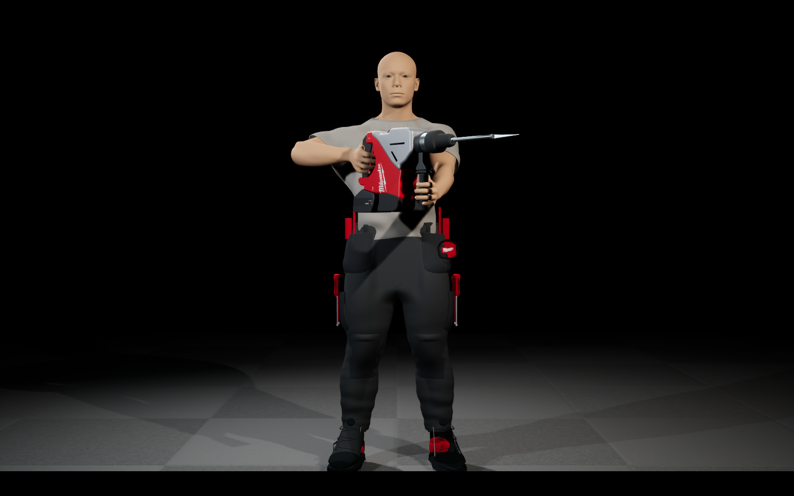
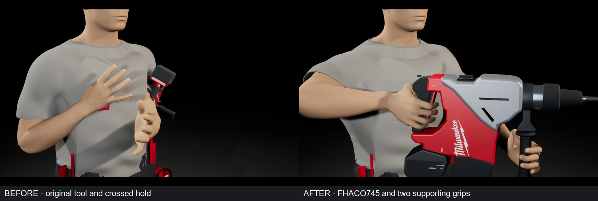
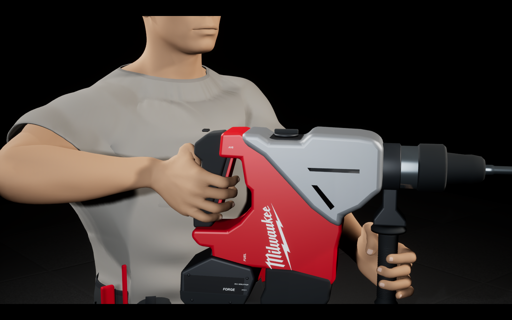
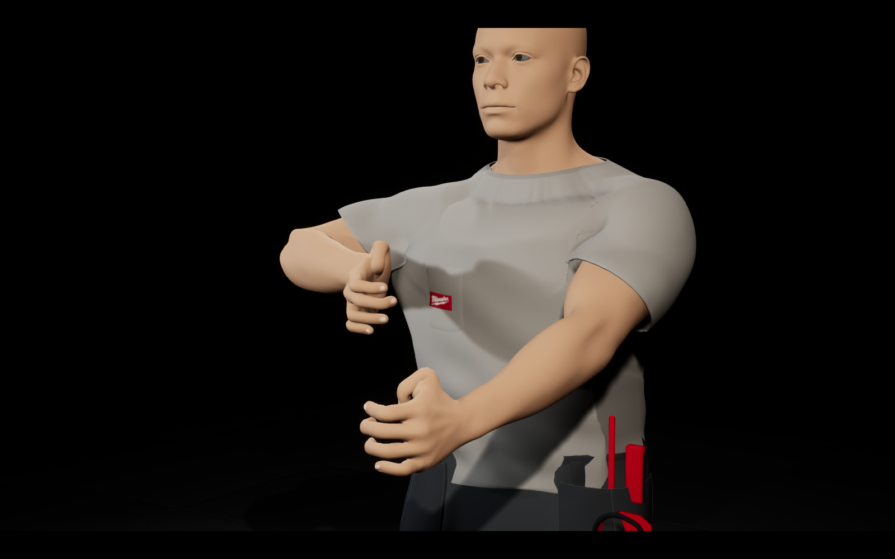
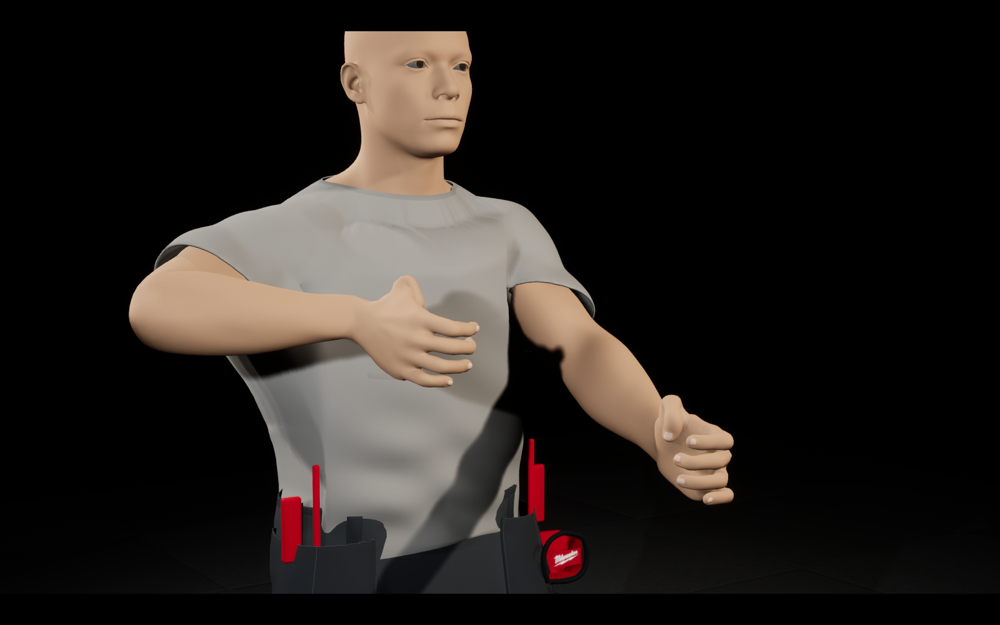
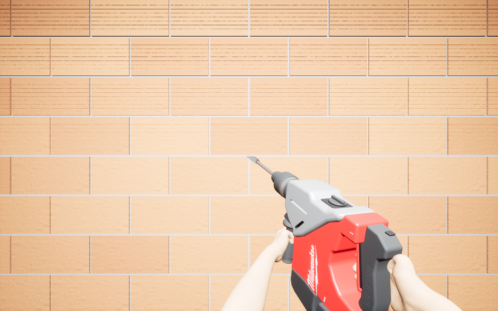
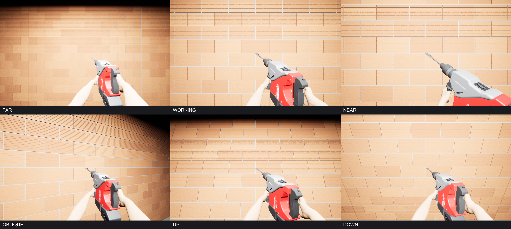
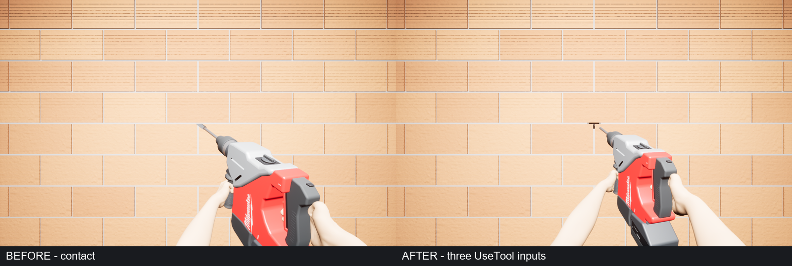

# FHACO745, two-hand hold and FPS — 26 September 2026

[Back to all Unreal progress](../../README.md)

Thirty images from local Unreal source commit `58906ea`. This gallery shows the authored Milwaukee FHACO745 reconstruction, worker grip changes and first-person integration in isolated review scenes. The game remains a work in progress. Images are copied without alteration; [manifest.json](manifest.json) records their original dimensions and SHA-256 hashes.

## Tool model

These two images are **Blender renders of the actual editable model**, not Unreal screenshots or generated concepts. The exterior follows the [Milwaukee M18 FHACO745 product reference](https://www.milwaukeetool.eu/en-eu/m18-fuel-45-mm-sds-max-drilling-and-breaking-hammer-with-one-key/m18-fhaco745/). It is an authored reconstruction, not manufacturer CAD or an official Milwaukee asset.

## Worker, hands and wrists

These are **native Unreal Engine 5.8.2 runtime captures** with neutral review lighting. The tool has a rear D grip and a downward auxiliary grip. The front view below shows the complete character. Existing clothing topology remains visible and has not been replaced.

The labeled comparison uses matched cameras and lighting. The individual original frames are linked below.

| View | Before | After |
| --- | --- | --- |
| Front | [Original front](before-front.png) | [Updated front](after-front.png) |
| Side | [Original side](before-side.png) | [Updated side](after-side.png) |
| Grips | [Original grips](before-grips.png) | [Updated grips](after-grips.png) |

Saved full-body and FPS poses were checked across 5,429 hand vertices; no penetration deeper than 1.5 mm was detected into the checked tool parts. This does not establish contact correctness for future animations.

## First-person views

Native 1600 × 1000 Unreal runtime screenshots. The tool keeps its full physical scale in FPS; hands and tool move together when withdrawing near the wall. Current game materials and lighting are shown as captured.

Original frames: [far](fps-far.png), [working](fps-working.png), [near](fps-near.png), [oblique](fps-oblique.png), [upward](fps-up.png), [downward](fps-down.png).

## Wall-contact check

Three calls through the actual UseTool input execution chain applied damage at working contact. Three inputs beyond the chisel tip's reach applied none. This checks current contact behavior; it is not a completed demolition animation or final wall-fracture art.

| Test | Before inputs | After inputs |
| --- | --- | --- |
| At working contact | [Contact before](fps-fire-contact.png) | [Contact after](fps-fire-contact-after.png) |
| Beyond reach | [Far before](fps-fire-far.png) | [Far after](fps-fire-far-after.png) |

## Additional runtime checks

- Camera switching: [first person](fps-CameraFirstPerson.png), [third-person camera selection](fps-CameraThirdPerson.png).
- Equipment switching: [hammer selected](fps-SelectHammer.png), [tape measure selected](fps-SelectTapeMeasure.png).
- Matched performance scene captures: [before](fps-performance-before.png), [after](fps-performance-after.png). These stills identify the scene; they do not themselves measure performance.

The existing player did not lower its camera on the attempted crouch check, so that capture is not included as successful crouch evidence. This update does not add crouch gameplay, new locomotion, or a drilling/recoil cycle. Publishing this gallery does not promote the isolated Unreal changes into the main project.
