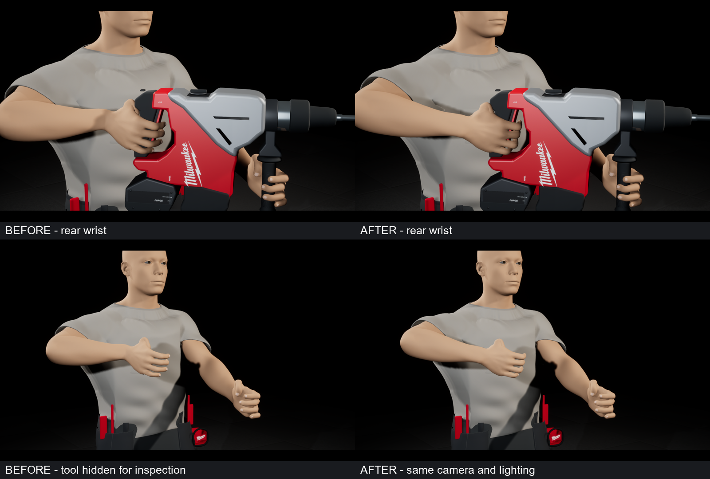
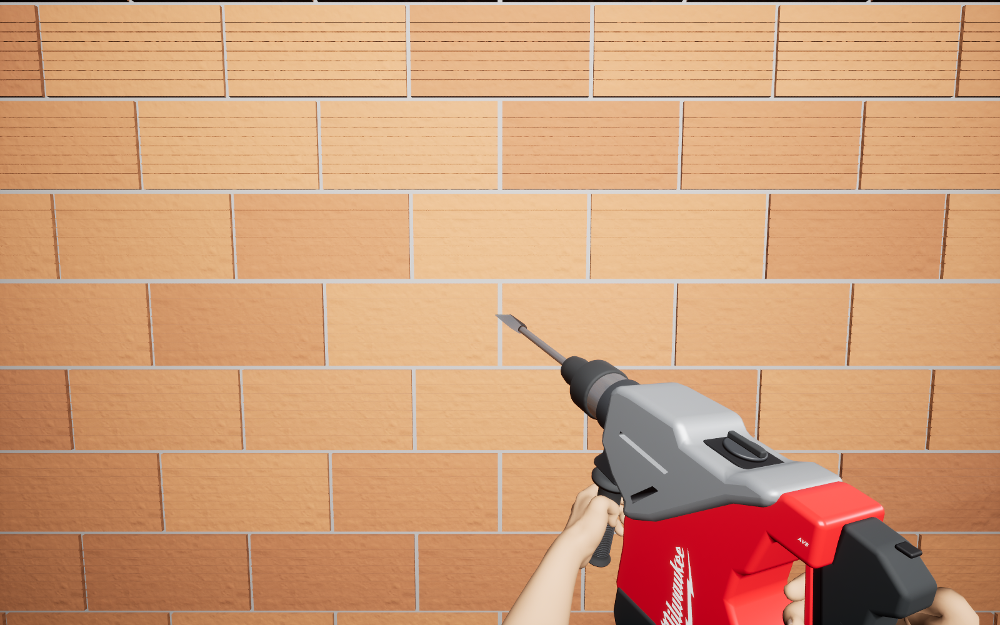
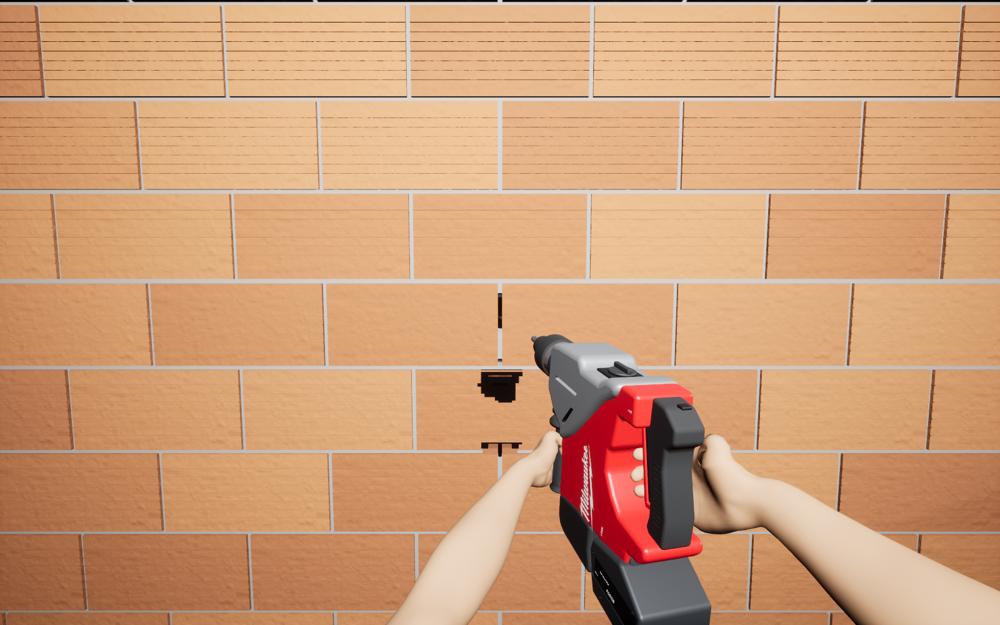
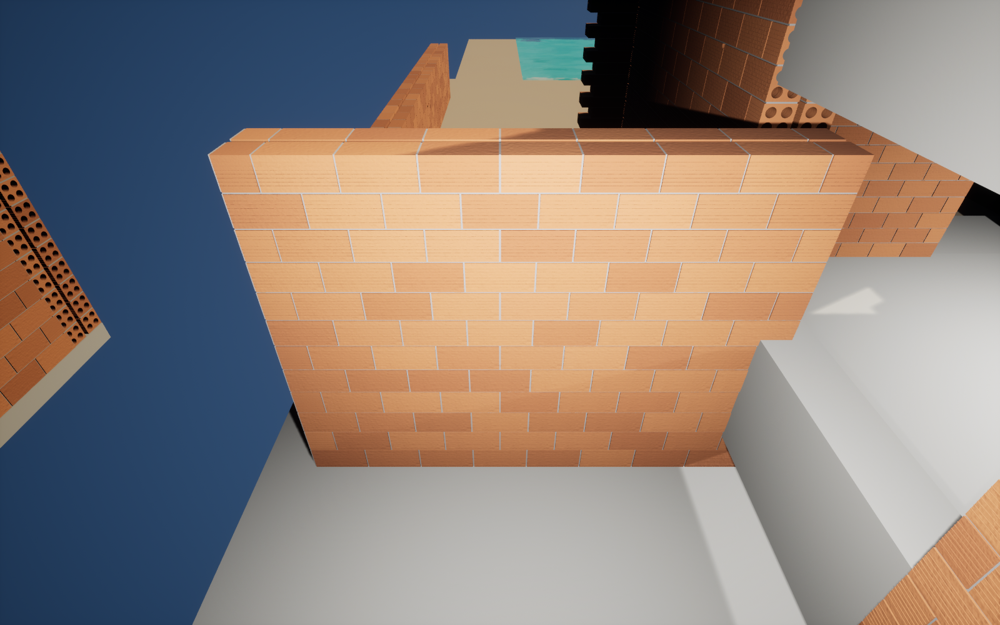

# Καρπός, συνεχόμενο SDS-max και Level Editor

26 Σεπτεμβρίου 2026. Αυθεντικές λήψεις Unreal 5.8.2 από απομονωμένη δοκιμαστική σκηνή. Διορθώθηκε ο δεξιός καρπός και προστέθηκε συνεχόμενο input για το FHACO745. **Η ρεαλιστική θραύση παραμένει ανολοκλήρωτη.** Δεν έγινε promotion στο κύριο παιχνίδι.

## Καρπός — πριν / μετά

Η γωνία αντιβραχίου/παλάμης μειώθηκε από 46,12° σε 1,50°, διατηρώντας τα αρχικά μήκη οστών. Οι έλεγχοι full-body και FPS πέρασαν για 5.429 κορυφές χεριών με ανοχή διείσδυσης 1,5 mm. Πρόκειται για έλεγχο της συγκεκριμένης πόζας, όχι όλων των πιθανών animations. Η σύνθεση μόνο μειώνει τις πρωτότυπες λήψεις και προσθέτει λεζάντες.

Πρωτότυπα 1600 × 1000: [πριν με εργαλείο](before-grips.png), [μετά με εργαλείο](after-grips.png), [πριν χωρίς εργαλείο](before-wrists-right.png), [μετά χωρίς εργαλείο](after-wrists-right.png).

## Συνεχόμενο χτύπημα — πραγματικό runtime, δοκιμαστική θραύση

Ίδια αρχική και τελική κάμερα. Η δοκιμή κρατά τη σκανδάλη, κατεβάζει τη στόχευση σε τρεις σειρές και επιστρέφει στην αρχική γωνία. Καλεί τα πραγματικά Pressed/Released chains σε αντίγραφο του player Blueprint, χωρίς άμεσες PointDamage κλήσεις από τον οδηγό και χωρίς έγχυση συμβάντων ποντικιού του λειτουργικού. Καταγράφηκαν 18 χτυπήματα, χωρίς πρόσθετη ζημιά μετά την απελευθέρωση, εκτός εμβέλειας ή μετά την αλλαγή εργαλείου.

**Οι σκαλοπατιαστές οπές δεν καλύπτουν ακόμη τη συμφωνημένη φυσική θραύση, τη συνέχεια στους αρμούς και τα αποκολλημένα θραύσματα.** Η σύντομη δοκιμή 1600 × 1000 σε RTX 5080 / Core Ultra 9 285K είχε μέσο frame 2,80 ms, p99 3,97 ms και αιχμή 37,63 ms. Η υψηλή μέση απόδοση δεν καλύπτει την αιχμή. Δεν είναι δοκιμή ολόκληρου εργοταξίου ή packaged EXE.

## Generator στον κανονικό Level Editor

Ο υπάρχων generator επαναχρησιμοποιείται μέσω **Tools → Wire the House → Build Selected Brick Wall (Rows / Columns)** και **Build Selected Brick Room / Floors**. Δεν υπάρχει in-game μενού κατασκευής. Τοίχος 12 σειρών × 8 μονάδων, 320 × 44 × 240 cm. Υπάρχει και δείγμα δύο ορόφων. Πέρασαν resize, μετακίνηση, save/reopen, προστασία ήδη δουλεμένου τοίχου και πραγματικός έλεγχος ότι και οι δύο builders μπλοκάρονται κατά το Simulate.

Windows cook: 799 packages, 0 σφάλματα, μία προειδοποίηση επίλυσης δικτυακού hostname. Οι προϋπάρχουσες ρυθμίσεις SM5 του έργου παραμένουν· η αλλαγή render path για Nanite/Virtual Shadow Maps δεν είναι μέρος αυτής της διόρθωσης.

Τοπικό source commit `1bf300a`, προστατευμένη βάση `58906ea`. Το αρχείο [manifest.json](manifest.json) καταγράφει hashes των αμετάβλητων εικόνων. Το repo περιέχει εικόνες προόδου, όχι το ιδιωτικό project ή επίσημο Milwaukee CAD.
